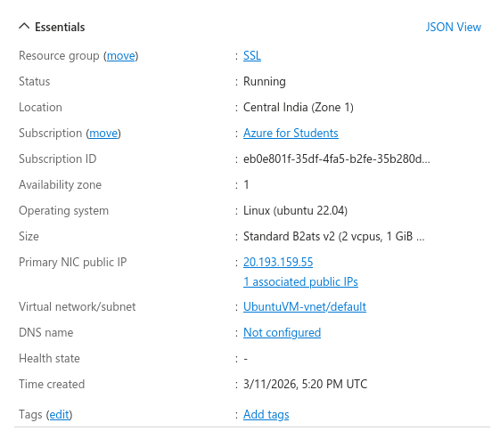
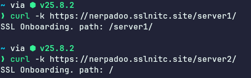
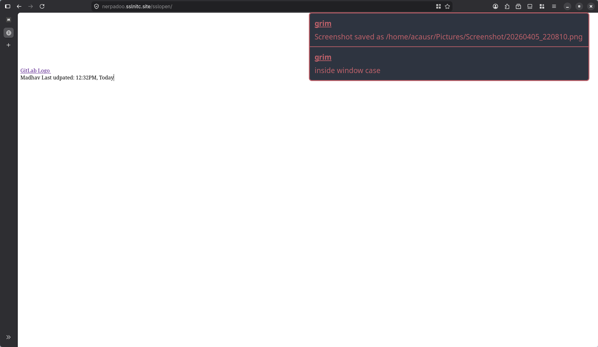
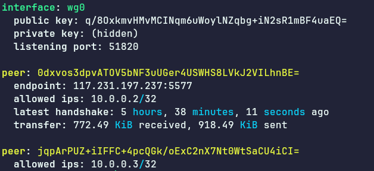
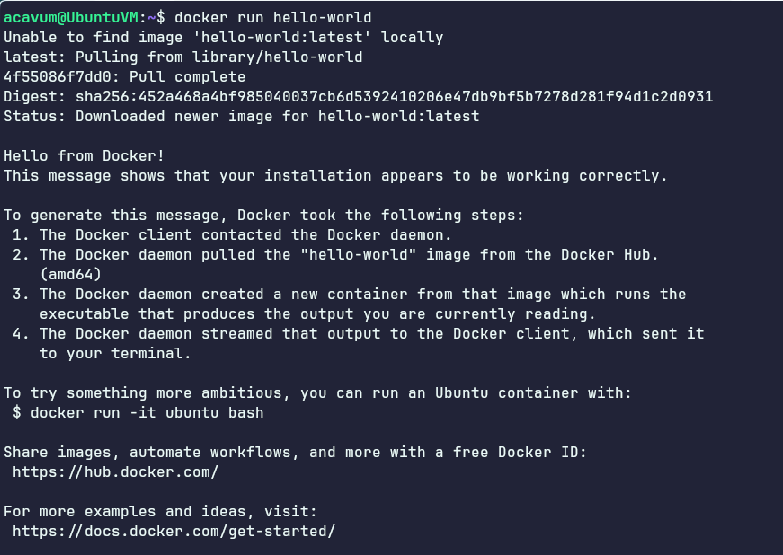
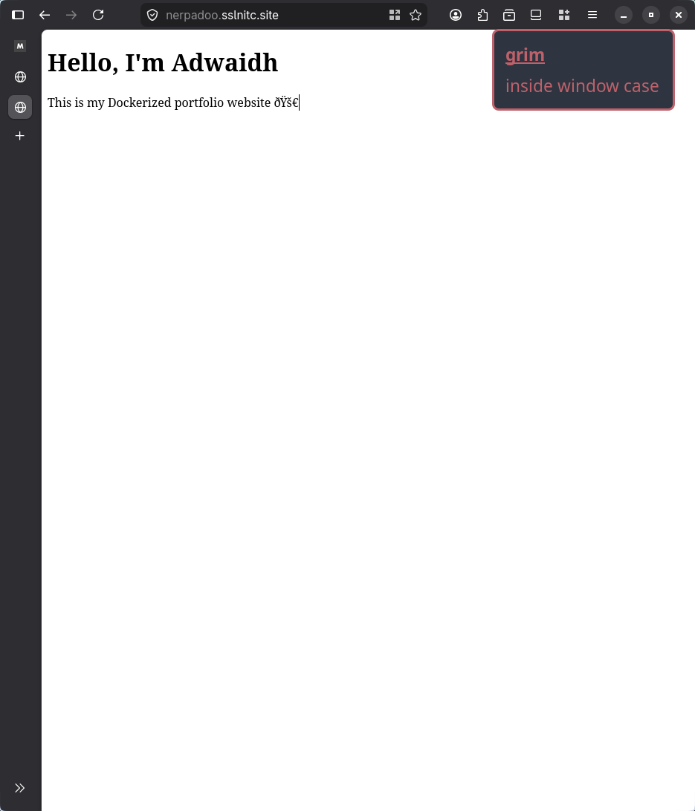

# SSL Admin Induction 2026 – Tasks Documentation

# Stage 1: Initial Setup

## 1. Create an Ubuntu VM in Azure
Created a VM in Azure
* iso : Ubuntu Server 22.04 LTS Canonical
* disk space : default
* memory: 8GB
* vcpu : 2 units
* static ip: 20.193.159.55
* SSH only



## 2. System Updates and security
Run
```bash
sudo apt update & sudo apt upgrade
```
to update installed packages to latest version

```bash
sudo apt install unattended-upgrades
```

Installs the package responsible for automatically applying updates.
```bash
sudo dpkg-reconfigure --priority=low unattended-upgrades
```
This command will now enable automatica updates.
By default, only security updates are enabled.
The file ```/etc/apt/apt.conf.d/50unattended-upgrades``` holds the config for automatic updates.

```
# Uncommented this line to enable regular updates too
"${distro_id}:${distro_codename}-updates"; 

# Uncommented this line to remove unused dependencies
Unattended-Upgrade::Remove-Unused-Dependencies "true";
```


The file ```/etc/apt/apt.conf.d/50unattended-upgrades``` contains the update schedule.
Did not change this because it was already set to daily.
```
APT::Periodic::Update-Package-Lists "1";
APT::Periodic::Unattended-Upgrade "1";
```
---

### Test the Configuration

Ran a dry run to verify setup without making any changes using

```bash
sudo unattended-upgrades --dry-run --debug
```
The update logs are stored at ```/var/log/unattended-upgrades/```


---

# Stage 2: Enhanced SSH Security
The file ```/etc/ssh/sshd_config``` is used to configure our ssh server.
## SSH Configuration

Important options

| Option | Value | Use |
| --------------- | --------------- | --------------- |
| Port | 22 | The default port used for ssh |
| PermitRootLogin | no | Disable users direct login as root |
| PasswordAuthentication | no | Remove password based Auth |
| PubKeyAuthentication | yes | Enable Auth using Public key |


Did not restrict SSH access to specific IP/ IP range as IPs are dynamic and change.
I think Public Key authenticaion is enough.
Only the user with the public key can access it.

Restart the service for changes to take place
```bash
sudo systemctl restart ssh
```

## Fail2Ban Setup

```bash
sudo apt install fail2ban
```
Fail2Ban has its default config at ```/etc/fail2ban/jail.conf```.
* Created a custon config file.
```bash
sudo cp /etc/fail2ban/jail.conf /etc/fail2ban/jail.local
```
* In the file there is a section for sshd. Edited that section like so
```
[sshd]
enabled  = true
port     = ssh      # This can be ssh (22) or just the port number used for ssh (22/2222)
                    # Must be the same values as Port option in /etc/ssh/sshd_config
maxretry = 5        # Maximum number of retries after invalid login
bantime  = 3600     # ban for 1 hour (3600s)
findtime = 600      # within 10 min (600s) window

#This config will ban the user for 1 hour if failed 5 times in a 10 min window.
```
* Enable and check the status
```bash
sudo systemctl enable fail2ban
sudo systemctl start fail2ban
sudo fail2ban-client status sshd 
```

## Optional: MFA

* Install Google Authenticator:
```bash
sudo apt install libpam-google-authenticator
```

* Running ```google-authenticator``` command will ask some prompts and then generate a qr.
The QR can be scanned by a Authenticator app to generate the code.
* Edit the SSH PAM and sshd_config files to enable MFA via google-authenticator
```
# File: /etc/pam.d/sshd

# Added this line to the top
auth required pam_google_authenticator.so

# commented out default password authline
# @include common-auth
```
```
# File: /etc/ssh/sshd_config

KbdInteractiveAuthentication yes
# We need keyboard interactive to enter the MFA code
AuthenticationMethods publickey,keyboard-interactive
UsePAM yes
```
* Then restart sshd
```
sudo systemctl restart sshd
```
---

# Stage 3: Firewall & Network Security

## UFW Configuration

```bash
sudo apt install ufw
sudo ufw default deny incoming
# installs ufw and denies all incoming traffic
```

Allow only required ports:

```bash
sudo ufw allow 2222/tcp   # SSH
sudo ufw allow 22/tcp   # SSH
sudo ufw allow 80/tcp     # HTTP
sudo ufw allow 443/tcp    # HTTPS
# Port 22 was also included because the Hostel and College WiFi did not allow port 2222.
```
Inbound rules for the corresponding ports must be added to Azure in Networking section for the VM.

Enable firewall:

```bash
sudo ufw enable
```

Enable logging:

```bash
sudo ufw logging on
```
ufw status can be seen by running
```bash
sudo ufw status [verbose]
```

---

# Stage 4: User & Permission Management

## User Setup

* Create users:
```bash
sudo useradd -m exam_1
sudo useradd -m exam_2
sudo useradd -m exam_3
sudo useradd -m examadmin
sudo useradd -m examaudit
```
password were given to all users using ```sudo passwd username```


* Give root privilege to examadmin
```bash
sudo usermod -aG sudo examadmin
```
* Give readonly access on examiner home folder to examaudit user
```setfacl``` command is used for this (needs the acl package)

```bash
# Install ACL tools
sudo apt install acl -y

# Grant examaudit read+execute access to each home dir
sudo setfacl -m u:examaudit:r-- /home/exam_{1,2,3}
```
## Home Directory Security

* Setup user only access to exam_* directories
```bash
sudo chmod 700 /home/exam_{1,2,3}
```
## Disk Quotas

* Install quota:

```bash
sudo apt install quota
```
* enable disk quota
```
# File: /etc/fstab
# Add the option usrquota,grpquota for enabling user and grp quota respectively to the line for root (/)

UUID=326bf812-1a76-40fe-8839-c1847638810f	/	ext4	discard,usrquota,grpquota,errors=remount-ro	0 1
```
* remount and enable
```bash
sudo mount -o remount /
sudo quotaon -v /
```
Unfortunately the system used the old usrquota file for quota which is a deprecated method.
I was unable to enable the ext4 quota feature, which is a problem with azure (known by consulting friends). So i used the deprecated method only.

```repquota /``` will give a detailed output on the quotas for users

```sudo edquota -u username``` will set the quota for the user.
it will open a text editor and a file with the format given below will be opend.
```
Disk quotas for user username (uid the_uid):
  Filesystem   blocks   soft    hard   inodes  soft  hard
  /dev/root        16      0       0        4     0     0
```
| Value | Meaning |
| -------------- | --------------- |
| blocks | The number of 1Kb blocks used by the user |
| inodes | The number of files used by the user |
| soft | The limit at which a warning is sent to user |
| hard | The limit at which the user is forbidden to use any more space |

```
# I gave all the exam user the same limit
# warning at ~0.9GB
# ban at 1GB
Disk quotas for user exam_1 (uid 1001):
  Filesystem                   blocks       soft       hard     inodes     soft     hard
  /dev/root                        16    1027604    1048576          4        0        0
```

## Backup Script

```bash
# File: /usr/lib/bin/backup_examiners.sh 

#!/bin/bash

BACKUP_DIR="/var/backups/examiners"
DATE=$(date +%Y-%m-%d)
LOG_FILE="/var/log/exam_backup.log"

mkdir -p "$BACKUP_DIR"

echo "[$DATE] Startup backup script for examiners" >> "$LOG_FILE"

for user in exam_1 exam_2 exam_3; do
	if [ -d "/home/$user" ]; then
		tar -czf "$BACKUP_DIR/${user}_${DATE}.tar.gz" -C /home "$user"
		echo "$user backup complete" >> "$LOG_FILE"
	else
		echo "$user doesnt have a home directory in /home" >> "$LOG_FILE"
	fi
done

echo "[$DATE] Backup complete" >> "$LOG_FILE"
find "$BACKUP_DIR" -type f -name "*.tar.gz" -mtime +7 -delete
acavum@UbuntuVM:~$ 
```
The backup script must be executed by examadmin only.
So the scripts owner must be examadmin with permission 700.
Same change mmust be made with the log folder.
```bash
sudo chown examadmin:examadmin /usr/local/bin/backup_exam_users.sh
sudo chmod 700 /usr/local/bin/backup_exam_users.sh
sudo mkdir -p /var/backups/exam_users
sudo chown examadmin:examadmin /var/backups/exam_users
sudo chmod 700 /var/backups/exam_users
```
After than i created a cronjob for the user testuser to run it daily
```
sudo crontab -u examadmin -e

0 2 * * * /usr/local/bin/backup_exam_users.sh
```
---

# Stage 5: Web Server Deployment

## Install Nginx

```bash
sudo apt install nginx
sudo systemctl enable nginx
sudo systemctl start nginx

# The app2 in this project needs bun which is a package available in npm
# So install them too
sudo apt install npm
sudo npm i bun -g
```

## Reverse Proxy Setup

### Preparing Applications

* Create non-privileged user testuser and switch
```bash
sudo useradd -m testuser
sudo passwd testuser
su - testuser
```
* In testuser prepare the applications
#### App1
Get app1 and verifiy the checksum
```bash
wget https://do.edvinbasil.com/ssl/app -O app1
wget https://do.edvinbasil.com/ssl/app.sha256.sig -O app1.sha256.sig

# check if $(sha256sum app1) == $(cat app1.sha256.sig) -> then its fine
chmod +x ./app1
```
#### App2
```bash
git clone https://gitlab.com/tellmeY/issslopen
cd issslopen
# The next steps are according to the README.md in issslopen
cp .env.example .env
bun install
```
* Run:
  ```bash
  ./app1 & # app1 will be running in background
  cd issslopen && bun start
  ```

  * app1 → port 8008
  * app2 → port 3000

## Nginx Configuration

[!NOTE] This must be done as the default user with sudo privilege
* Generate an ssl certificate for the ip (nerpadoo.sslnitc.site) using certbot
```bash
sudo apt install certbot python3-certbot-nginx
sudo certbot --nginx -d nerpadoo.sslnitc.site

# This will give a certificate and a key.
# This is a self signed certificate
```

```
# File: /etc/nginx/sites-available/default
# Redirect HTTP -> HTTPS
server {
	listen 80;
	server_name nerpadoo.sslnitc.site;

	return 301 https://$host$request_uri;
}

server {
	listen 443 ssl;
	server_name nerpadoo.sslnitc.site;

    ssl_certificate /etc/letsencrypt/live/nerpadoo.sslnitc.site/fullchain.pem; # managed by Certbot
    ssl_certificate_key /etc/letsencrypt/live/nerpadoo.sslnitc.site/privkey.pem; # managed by Certbot

    add_header Content-Security-Policy "default-src 'self'; script-src 'self' 'unsafe-inline;";

	# SERVER 1 -> app1
	location /server1/ {
		proxy_pass http://127.0.0.1:8008;
	}

	#SERVER 2 -> app2 (root path)
	location /server2/ {
		proxy_pass http://127.0.0.1:8008/;
	}

	#SSL OPEN -> app2 endpoint
	location /sslopen/ {
		proxy_pass http://127.0.0.1:3000/;
	}

}
```
```bash
# test the nginx config
sudo nginx -t
# Restart the service
sudo systemctl restart nginx.service 
```



Since the ports 3000 and 8008 are left open it is neccessary to 

## Testing
 On browser

 * [x] https://nerpadoo.sslnitc.site/server1/ -> returns SSL Onboarding. path: /server1/
 * [x] https://nerpadoo.sslnitc.site/server2/ -> returns SSL Onboarding. path: /
 * [x] https://nerpadoo.sslnitc.site/sslopen -> Opened ssl app

---

# Stage 6: Database Security

## Install MariaDB

```bash
sudo apt install mariadb-server
sudo systemctl enable mariadb
sudo systemctl start mariadb
sudo mysql_secure_installation

# did not setup a root passwd
```

## Database setup
Then enter mariadb shell with ```sudo mysql -u root -p```
```sql
-- Inside the mariadb shell
-- Create DATABASE
CREATE DATABASE secure_onboarding;
-- Create user with minimal privileges
-- The password is not Password
CREATE USER 'onboarding_user'@'localhost' IDENTIFIED BY 'Password';
GRANT SELECT, INSERT, UPDATE, DELETE ON secure_onboarding.* TO 'onboarding_user'@'localhost';
-- Apply the changes
FLUSH PRIVILEGES;
```

## Security Measures
* Root login was disabled during setup when run ```sudo mysql_secure_installation```
```sql
SELECT host, user FROM mysql.user WHERE user = 'root';

-- This returned the table 
+-----------+------+
| Host      | User |
+-----------+------+
| localhost | root |
+-----------+------+
-- root login is only allowed from localhost
```

Bind-address in ```/etc/mysql/mariadb.conf.d/50-server.cnf``` was already 127.0.0.1

So nothing needed to be done.

## Automated Backups

Similar to stage 4, created a cronjob
```bash
# File: /usr/local/bin/mariadb_bak.sh

#!/bin/bash

BACKUP_DIR="/var/backups/mariadb"
DATE=$(date +%F)
mkdir -p "$BACKUP_DIR"
mysqldump -u root secure_onboarding > "$BACKUP_DIR/secure_onboarding_$DATE.sql"
find "$BACKUP_DIR" -type f -name "*.sql" -mtime +7 -delete
```
```bash
chmod +x /usr/local/bin/mariadb_bak.sh
sudo crontab -e
0 2 * * * /usr/local/bin/db_backup.sh
```

---

# Stage 7: VPN Configuration (WireGuard)

## Install WireGuard

```bash
sudo apt install wireguard
```

## Server Setup

* Generate keys:

```bash
# Server keys
wg genkey | sudo tee /etc/wireguard/server_pkey | wg pubkey | sudo tee /etc/wireguard/server_pubkey

# User 1 keys
wg genkey | sudo tee /etc/wireguard/user1_pkey | wg pubkey | sudo tee /etc/wireguard/user1_pubkey

# User 2 keys
wg genkey | sudo tee /etc/wireguard/user2_pkey | wg pubkey | sudo tee /etc/wireguard/user2_pubkey

# Private keys shouldnt be readable to all. Only the root (owner)
sudo chmod 600 /etc/wireguard/server_pkey
sudo chmod 600 /etc/wireguard/user{1,2}_pkey
```

* default interface was eth0: got by running ```ip route | grep default```

* Configure Client `/etc/wireguard/wg0.conf`
```
# File: /etc/wireguard/wg0.conf

[Interface]
Address = 10.0.0.1/24
ListenPort = 51820
PrivateKey = <SERVER_PRIVATE_KEY>

#Enable NAT
PostUp = iptables -A FORWARD -i wg0 -o eth0 -j ACCEPT; iptables -A FORWARD -i eth0 -o wg0 -m state --state RELATED,ESTABLISHED -j ACCEPT; iptables -t nat -A POSTROUTING -s 10.0.0.0/24 -o eth0 -j MASQUERADE
PostDown = iptables -D FORWARD -i wg0 -o eth0 -j ACCEPT; iptables -D FORWARD -i eth0 -o wg0 -m state --state RELATED,ESTABLISHED -j ACCEPT; iptables -t nat -D POSTROUTING -s 10.0.0.0/24 -o eth0 -j MASQUERADE

# user1
[Peer]
PublicKey = 0dxvos3dpvATOV5bNF3uUGer4USWHS8LVkJ2VILhnBE=
AllowedIPs = 10.0.0.2/32

# user2
[Peer]
PublicKey = jqpArPUZ+iIFFC+4pcQGk/oExC2nX7Nt0WtSaCU4iCI=
AllowedIPs = 10.0.0.3/32

```

## Client Setup

* User 1 config
```
# File: /etc/wireguard/user1.conf

[Interface]
PrivateKey = QMrx7vztOjy07abljfLwh75HGO8Sax6uDVU0asH+tXE=
Address = 10.0.0.2/24
DNS = 8.8.8.8

[Peer]
PublicKey = q/8OxkmvHMvMCINqm6uWoylNZqbg+iN2sR1mBF4uaEQ=
Endpoint = nerpadoo.sslnitc.site:51820
AllowedIPs = 0.0.0.0/0
PersistentKeepalive = 25
```
* User 2 config
```
# File: /etc/wireguard/user2.conf

[Interface]
PrivateKey = eP6O3aPvc9XI4Ln5cc8RNCkGtdTIi5JakMZen4zXrkA=
Address = 10.0.0.3/24
DNS = 8.8.8.8

[Peer]
PublicKey = q/8OxkmvHMvMCINqm6uWoylNZqbg+iN2sR1mBF4uaEQ=
Endpoint = nerpadoo.sslnitc.site:51820
AllowedIPs = 0.0.0.0/0
PersistentKeepalive = 25
```
## Networking

* Enable IP forwarding:

```bash
# Enable IP forwarding
echo "net.ipv4.ip_forward=1" | sudo tee -a /etc/sysctl.conf
sudo sysctl -p
```
## Enable VPN
wg0 is the new interface created
```bash
sudo systemctl enable wg-quick@wg0
sudo systemctl start wg-quick@wg0
# Open this port for wireguard
sudo ufw allow 51820/udp comment 'WireGuard VPN'
```


## testing 
* ```qrencode``` is used to create the qrcodes
```bash
sudo apt install qrencode
sudo cat /etc/wireguard/user1.conf | qrencode -t ansiutf8
```
After scanning the qr generated in wiregaurd in mobile, ifconfig.me showed the ip of the VM.

---
# Stage 7: VPN Configuration (WireGuard)

## Installation and setup

Docker was already installed and enabled as part of stage 5. But the user added to the group was the test user
```bash
sudo usermod -aG docker acavum
```


## Portfolio Website
Made a folder named portfolio with index.html inside
```html
<!DOCTYPE html>
<html>
	<head>
		<title>Adwaidh's Portfolio</title>
	</head>
	<body>
		<h1>Hello, I'm Adwaidh</h1>
		<p>This is my Dockerized portfolio website 🚀</p>
	</body>
</html>

```

Running the container
```bash
docker run -d
--name portfolio-container
-p 8080:80
-v ~/portfolio:/usr/share/nginx/html:ro
--restart unless-stopped nginx
```

The portfolio folder is owned by the $USER with permission 755

And after that i modified the previous nginx config
```
server {
	listen 80;
	server_name nerpadoo.sslnitc.site;

	return 301 https://$host$request_uri;
}

server {
	listen 443 ssl;
	server_name nerpadoo.sslnitc.site;

    	ssl_certificate /etc/letsencrypt/live/nerpadoo.sslnitc.site/fullchain.pem; # managed by Certbot
    	ssl_certificate_key /etc/letsencrypt/live/nerpadoo.sslnitc.site/privkey.pem; # managed by Certbot

	add_header Content-Security-Policy "default-src 'self'; script-src 'self' 'unsafe-inline';";

	# Portfolio
	location / {
		proxy_pass http://127.0.0.1:8080;
		proxy_set_header Host $host;
		proxy_set_header X-Real-IP $remote_addr;
	}

	# SERVER 1 -> app1
	location /server1/ {
		proxy_pass http://127.0.0.1:8008;
		proxy_set_header Host $host;
	}

	#SERVER 2 -> app2 (root path)
	location /server2/ {
		proxy_pass http://127.0.0.1:8008/;
		proxy_set_header Host $host;
	}

	#SSL OPEN -> app2 endpoint
	location /sslopen/ {
		proxy_pass http://127.0.0.1:3000/;
		proxy_set_header Host $host;
	}

}
```

A systemd service was created ```/etc/systemd/system/portfolio.service``` to keep it running on startup
```ini
[Unit]
Description=Portfolio Docker Container
After=docker.service
Requires=docker.service

[Service]
Restart=always
ExecStart=/usr/bin/docker start -a portfolio-container
ExecStop=/usr/bin/docker stop -t 2 portfolio-container

[Install]
WantedBy=multi-user.target
```
```bash
sudo systemctl daemon-reexec
sudo systemctl enable portfolio
sudo systemctl start portfolio
```

After reloading the nginx config too

